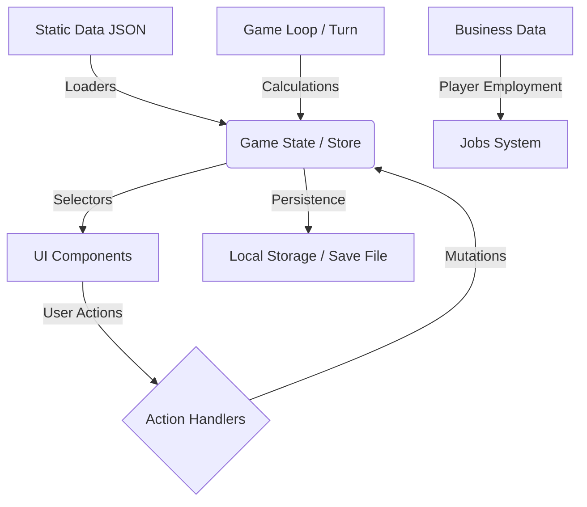
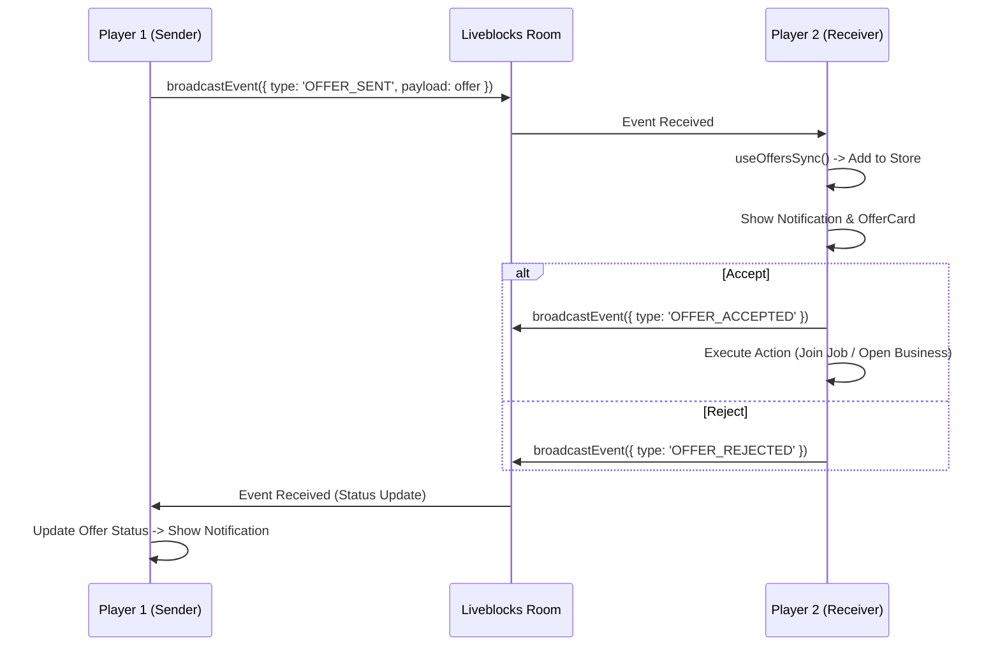

# LifeSim — Data Flow & Architecture Map

> **Масштаб проекта**: ~1.5 GB данных (включая ассеты), 100+ модулей логики, 50+ компонентов UI.
> **Архитектура**: Data-Driven Design с четким разделением на слои данных, логики и представления.

## 1. 🗺️ Глобальная Карта Потоков Данных (Data Flow)



---

## 2. 🗄️ Layer 1: Static Data (Фундамент)
*Неизменяемые конфигурационные файлы, определяющие баланс и контент игры.*

### 🌍 World & Economy (Мир и Экономика)
| Файл / Путь | Описание | Объем (строк) | Назначение |
| :--- | :--- | :--- | :--- |
| `shared/data/world/countries.json` | Список стран | ~50 | Базовые параметры доступных стран |
| `shared/data/world/country-archetypes.json` | Архетипы экономик | ~100 | Модели налогов, инфляции и роста ВВП |
| `shared/data/world/commons/skills.json` | Навыки | ~30 | Дерево навыков игрока |
| `shared/data/world/commons/human-traits.json` | Черты характера | ~80 | Влияние черт на игру |

### 🏙️ Country Specifics (Локализация Контента)
*Данные, уникальные для каждой страны (US, Germany, Brazil).*
| Категория | Путь (пример для US) | Описание | Ключевые поля |
| :--- | :--- | :--- | :--- |
| **Jobs** | `.../us/jobs.json` | Вакансии | `title`, `salary`, `requirements` |
| **Housing** | `.../us/housing.json` | Недвижимость | `type`, `price`, `monthlyRent` |
| **Education** | `.../us/courses.json` | Курсы и университеты | `name`, `cost`, `skillBonus`, `duration` |
| **Business** | `.../us/businesses.json` | Типы бизнесов | `initialCost`, `availablePositions`, `requiredRoles` |
| **NPCs** | `.../us/npcs.json` | Персонажи | `name`, `traits`, `relationship` |
| **Shops** | `.../us/shop-categories/*.json` | Товары | `food`, `health`, `services` |

### 🧩 Game Mechanics (Игровая Механика)
| Файл | Описание | Использование |
| :--- | :--- | :--- |
| `shared/data/events/crisis-options.json` | Сценарии кризисов | Генерация экономических событий |
| `shared/data/business/business-events.json` | События в бизнесе | Случайные события для бизнесов |
| `shared/data/business/idea-templates.json` | Шаблоны бизнес-идей | Генератор идей для игрока |
| `shared/data/employees/employee-data.json` | Данные сотрудников | Генерация кандидатов |
| `shared/data/housing/housing-options.json` | Опции жилья | Рынок недвижимости |

---

## 3. ⚙️ Layer 2: Data Ingestion (Загрузчики)
*Модули, преобразующие сырые JSON в типизированные структуры TypeScript.*

**Расположение:** `core/lib/data-loaders/`

| Loader Module | Источник данных | Выходной тип | Валидация |
| :--- | :--- | :--- | :--- |
| `economy-loader.ts` | `economy.json` | `EconomyConfig` | Zod Schema |
| `jobs-loader.ts` | `jobs.json` | `JobOpportunity[]` | Zod Schema |
| `housing-loader.ts` | `housing.json` | `RealEstateListing[]` | Zod Schema |
| `businesses-loader.ts` | `businesses.json` | `BusinessType[]` | Zod Schema |
| `characters-loader.ts` | `characters.json` | `NpcTemplate[]` | Zod Schema |
| `shop-categories-loader.ts` | `shop-categories/*.json` | `ShopItem[]` | Zod Schema |
| **Total Loaders** | **15+ модулей** | **Строгая типизация** | **Runtime validation** |

---

## 4. 🧠 Layer 3: Core Logic (Вычислительное Ядро)
*Чистые функции и алгоритмы, управляющие симуляцией.*

**Расположение:** `core/lib/`

### 💰 Financial Engine (Финансы)
| Модуль | Функция | Входные данные | Результат |
| :--- | :--- | :--- | :--- |
| `calculations/calculateQuarterlyIncome.ts` | Расчет доходов | Зарплата, Дивиденды, Бизнес | `TotalIncome` |
| `calculations/calculateQuarterlyExpenses.ts` | Расчет расходов | Жилье, Еда, Кредиты, Налоги | `TotalExpenses` |
| `calculations/calculateQuarterlyTaxes.ts` | Налоговая система | Доход, Страна, Льготы | `TaxAmount` |
| `calculations/inflation-system.ts` | Инфляция | Текущий год, Экономика страны | `PriceModifier` |
| `calculations/loan-calculator.ts` | Кредитный калькулятор | Сумма, Ставка, Срок | `MonthlyPayment` |

### 🏢 Business Engine (Бизнес-логика)
**Расположение:** `core/lib/business/` *(Модульная структура)*

| Модуль | Функции | Описание |
| :--- | :--- | :--- |
| `employee-generator.ts` | `generateEmployeeCandidate`, `generateCandidates` | Генерация кандидатов на работу |
| `employee-calculations.ts` | `calculateEmployeeKPI` | Расчет KPI сотрудников |
| `business-metrics.ts` | `calculateEfficiency`, `calculateReputation` | Метрики бизнеса |
| `business-financials.ts` | `calculateBusinessFinancials` | Финансовые расчеты бизнеса |
| `business-events.ts` | `generateBusinessEvents` | Генерация случайных событий |
| `npc-voting.ts` | `calculateNPCVote` | Голосование партнеров |

### 🧬 Life Simulation (Симуляция Жизни)
| Модуль | Функция | Описание |
| :--- | :--- | :--- |
| `calculatePersonalLife.ts` | Личные показатели | Расчет счастья, здоровья и энергии |
| `applyStats.ts` | Применение эффектов | Изменение статов от действий (еда, спорт) |
| `generateGlobalEvents.ts` | Генератор событий | Создание кризисов, бумов и новостей |
| `threshold-effects.ts` | Пороговые эффекты | Влияние критических значений статов |

---

## 5. 💾 Layer 4: State Management (Состояние)
*Единый источник правды (Single Source of Truth) для всего приложения.*

**Store:** `core/model/game-store.ts` (Zustand)

### Структура State (Основные ветки)
1.  **`player`**: Данные игрока
    - `stats` — деньги, здоровье, счастье, энергия
    - `jobs[]` — текущие работы (включая работу в своем бизнесе)
    - `businesses[]` — собственные бизнесы
    - `assets[]` — активы (недвижимость, акции)
    - `debts[]` — долги и кредиты
    
2.  **`world`**: Состояние мира
    - `turn`, `year` — текущий ход и год
    - `countries` — экономические показатели стран
    - `globalEvents[]` — глобальные события
    
3.  **`notifications`**: Уведомления и события
4.  **`pendingApplications`**: Заявки на работу/фриланс

### Slices (Модули состояния)
| Slice | Ответственность | Ключевые действия |
| :--- | :--- | :--- |
| `game-slice.ts` | Игровой цикл | `nextTurn`, `initializeGame`, `resetGame` |
| `player-slice.ts` | Данные игрока | `updatePlayer`, `applyStatChanges` |
| `job-slice.ts` | Работа | `applyForJob`, `acceptJobOffer`, `quitJob` |
| `business-slice.ts` | Бизнес | `openBusiness`, `hireEmployee`, `joinBusinessAsEmployee` |
| `education-slice.ts` | Образование | `studyCourse`, `applyToUniversity` |
| `family-slice.ts` | Семья | `startDating`, `tryForBaby`, `adoptPet` |

---

## 6. 🖥️ Layer 5: Features & UI (Представление)
*Модули, отображающие данные и принимающие действия игрока.*

**Расположение:** `features/`

| Feature Module | Компоненты | Используемые данные | Действия |
| :--- | :--- | :--- | :--- |
| **Activities/Work** | `WorkActivity`, `VacanciesSection` | `jobs.json`, `businesses.json` | Устроиться на работу, Открыть бизнес |
| **Activities/Education** | `EducationActivity`, `CoursesList` | `courses.json` | Учиться, Поступить в университет |
| **Activities/Family** | `FamilyActivity`, `DatingSection` | `npcs.json` | Свидание, Завести ребенка |
| **Business** | `BusinessManagementDialog` | `business state` | Управление бизнесом, Нанять сотрудника |
| **Finances** | `BanksActivity`, `InvestmentsView` | `assets`, `loans` | Взять кредит, Купить акции |
| **Shop** | `ShopActivity`, `ShopCategories` | `shop-categories/*.json` | Купить товар, Изменить образ жизни |

---

## 7. 🔄 Новая Фича: Работа в Своем Бизнесе

### Поток данных
```
1. Static Data (businesses.json) → availablePositions[]
   ↓
2. Data Loader (businesses-loader.ts) → BusinessType
   ↓
3. Player opens business → Business created in state
   ↓
4. UI: BusinessManagementDialog shows available positions
   ↓
5. Player clicks "Устроиться" → joinBusinessAsEmployee(businessId, role, salary)
   ↓
6. Action updates:
   - business.playerEmployment = { role, salary, startedTurn }
   - player.jobs[] += new Job (linked to business)
   ↓
7. Turn Logic → calculateQuarterlyIncome includes business job salary
   ↓
8. UI: Work Activity shows business job in "Current Jobs"
```

### Типы данных
```typescript
// В businesses.json
{
  "availablePositions": [
    {
      "role": "manager",
      "salary": 8000,
      "description": "Управление бизнесом"
    }
  ]
}

// В Business type
interface Business {
  playerEmployment?: {
    role: EmployeeRole;
    salary: number;
    startedTurn: number;
  };
}

// В Jobs
interface Job {
  id: "job_business_{businessId}";
  title: "{role} в {businessName}";
  company: businessName;
  salary: quarterl ySalary / 3; // Месячная зарплата
}
```

```

---

## 8. 🌐 Multiplayer Offers System (Система Предложений)

### Архитектура
Единая система для обработки взаимодействий между игроками в реальном времени.

### Типы Предложений (`GameOffer`)
1. **Job Offer**: Предложение работы от игрока-владельца бизнеса другому игроку.
   - Настраиваемая зарплата (слайдер до $1,000,000 + ручной ввод).
   - KPI бонусы.
2. **Partnership Offer**: Предложение открыть бизнес совместно.
   - Разделение долей (10-90%).
   - Совместные инвестиции.
3. **Share Sale Offer**: Предложение купить долю в существующем бизнесе (Planned).

### Технические детали
- **Идентификация**: Используется `connectionId` от Liveblocks для точной адресации офферов.
- **Синхронизация**: Хук `useOffersSync` слушает события и обновляет локальный стейт.
- **UI**: Компоненты `OfferCard` и `OffersList` для отображения входящих предложений.

### Поток данных (Liveblocks)


### Ключевые компоненты
- **Store Slice**: `createGameOffersSlice` (управление состоянием офферов)
- **Sync Hook**: `useOffersSync` (синхронизация через Liveblocks)
- **UI**: `OfferCard`, `OffersList` (отображение)

---

## 9. 🛠️ Технический Стек и Инструменты

- **Core**: TypeScript, React 18, Next.js 14
- **State**: Zustand (модульная архитектура slices)
- **Validation**: Zod (для проверки JSON и Save-файлов)
- **Styling**: Tailwind CSS + CSS Modules
- **Testing**: Vitest (Unit tests for calculations)
- **Persistence**: LocalStorage + SuperJSON (сериализация)

---

## 10. 📊 Статистика Проекта

### Код
- **TypeScript файлов**: 111+
- **React компонентов**: 50+
- **Модулей логики**: 100+
- **Типов данных**: 200+

### Данные
- **JSON файлов**: 88+
- **Стран**: 3 (US, Germany, Brazil)
- **Бизнесов**: 12+ (4 на страну)
- **Работ**: 30+ (10 на страну)
- **Товаров в магазине**: 50+

### Архитектура
- **Слоев**: 5 (Data → Loaders → Logic → State → UI)
- **Slices**: 10+ (модульное состояние)
- **Loaders**: 15+ (валидация данных)

---

## 11. 🚀 Quick Start (Команды)

```bash
# 1. Установка всех зависимостей
pnpm install

# 2. Запуск локального сервера разработки
pnpm dev

# 3. Сборка проекта (Production Build)
pnpm build

# 4. Запуск тестов (проверка логики)
pnpm test

# 5. Линтинг кода
pnpm lint
```

---

## 12. 📝 Ключевые Принципы Архитектуры

1. **Разделение ответственности**: UI не содержит бизнес-логику
2. **Типобезопасность**: Все данные валидируются через Zod
3. **Модульность**: Код разбит на переиспользуемые модули
4. **Data-Driven**: Баланс игры настраивается через JSON
5. **Immutability**: Состояние изменяется только через actions
6. **Testability**: Чистые функции легко тестируются

---

**Последнее обновление**: 2025-12-05
**Версия**: 2.0 (с поддержкой работы в своем бизнесе)
