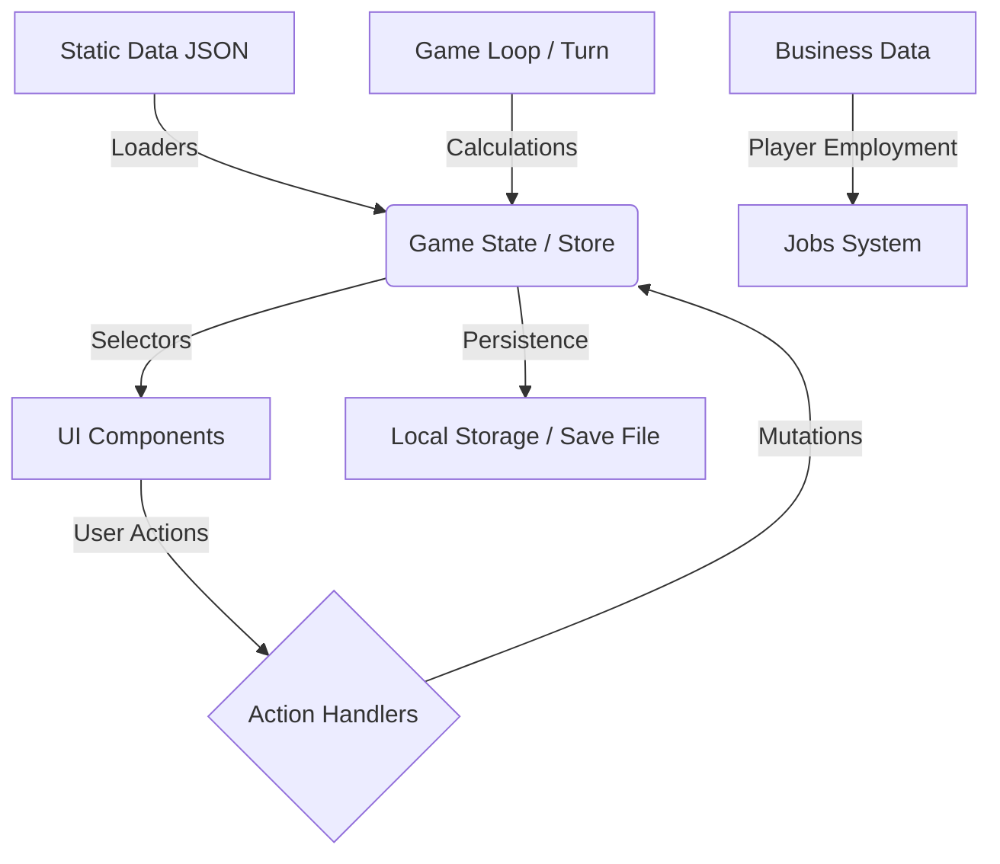
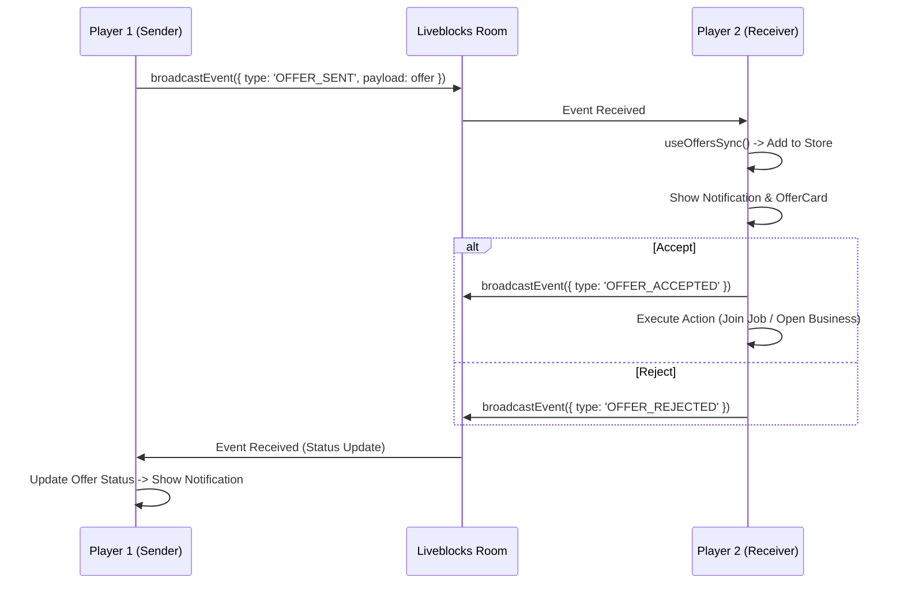

# ArtSurv - Life Simulation Game

> **Масштаб проекта**: ~1.5 GB данных (включая ассеты), 100+ модулей логики, 50+ компонентов UI.
> **Архитектура**: Data-Driven Design с четким разделением на слои данных, логики и представления.

## 🎮 О проекте

**ArtSurv** - это образовательная игра-симулятор жизни, которая учит игроков принимать сбалансированные решения с долгосрочными последствиями.

**Цель проекта**: Предоставить игрокам безопасное пространство для "проживания" жизни в игре, где они могут:
- Экспериментировать с финансовыми, карьерными и жизненными решениями
- Учиться жить сбалансированно и выполнять действия с долгосрочной перспективой
- Получать инсайты о взаимосвязи краткосрочных выгод и долгосрочных последствий

### 🎯 Ключевая философия игры:
> **"Дешевая еда повышает счастье сегодня, но снижает здоровье завтра"**

Игра демонстрирует, как краткосрочные решения влияют на долгосрочное благополучие.

---

## 1. 🗺️ Глобальная Карта Потоков Данных (Data Flow)



---

## 2. 🎮 Игровые Механики и Системы

### 🔢 Система Статистик (6 ключевых показателей)
| Стат | Назначение | Влияние | Пороговые эффекты |
|------|------------|---------|-------------------|
| **`money`** | Финансовое состояние | Возможность покупать, инвестировать, платить по счетам | Низкий баланс -> финансовый кризис |
| **`happiness`** | Эмоциональное благополучие | Влияет на все действия и решения. | **<30** -> несчастье, **<20** -> эмоциональное истощение, **<10** -> глубокая депрессия (штрафы к работе) |
| **`energy`** | Энергия | Ограничивает количество действий за ход | Низкий уровень -> невозможность работать |
| **`health`** | Физическое здоровье | Критический уровень приводит к окончанию игры | **<30** -> ухудшение самочувствия, **<20** -> плохое самочувствие (штраф к эффективности, мед. расходы), **<10** -> тяжелая болезнь (госпитализация, мед. расходы, нельзя работать) |
| **`sanity`** | Психическое здоровье | Влияет на принятие решений, низкий уровень → депрессия | Низкий уровень -> ментальный коллапс |
| **`intelligence`** | Интеллект | Влияет на освоение навыков и качество работы | Низкий уровень -> деградация |

### ⏰ Временная система
- **1 ход = 1 квартал** (3 месяца)
- **4 хода = 1 год**
- **Каждый год (Q1)** происходит пересчет инфляции и рост цен

### 🏢 Бизнес-система
**Основные операции**:
1. **Открытие бизнеса** - создание нового (от $10,000)
2. **Управление**:
   - **Изменение цены продукции/услуг** - влияет на спрос и прибыль
   - **Установка количества продукции** - для товарных бизнесов
   - **Найм/увольнение сотрудников** - NPC или других игроков. Сотрудники влияют на KPI бизнеса (бухгалтеры снижают налоги, менеджеры повышают эффективность, маркетологи улучшают репутацию).
3. **Бизнес-сети** - создание сети филиалов одного типа (филиалы открываются быстрее)

**Расчет финансовых показателей бизнеса (`core/lib/business/business-financials.ts`)**:
- Учитывает расходы на сотрудников, аренду, коммунальные услуги.
- **Снижение расходов**: Бухгалтеры и навыки игрока (например, роль "менеджера") могут уменьшать базовые расходы.
- **Расчет налогов**: Происходит с учетом валовой прибыли и налоговой ставки. Бухгалтеры могут снижать налоговое бремя.
- **Доход от продаж/услуг**: Зависит от базового спроса, эффективности бизнеса, репутации, цены, глобального рынка и навыков игрока (бонусы к продажам).
  - **Товарные бизнесы**: Управляют запасами (currentStock, maxStock), автозакупкой (autoPurchaseAmount).
  - **Услуговые бизнесы**: Доход рассчитывается на основе спроса на услуги.

**Расчет метрик бизнеса (`core/lib/business/business-metrics.ts`)**:
- **Эффективность (0-100)**: Зависит от минимального штата, средней эффективности сотрудников, бонусов от менеджеров, навыков игрока и недавних событий. Низкая эффективность -> снижает продажи.
- **Репутация (0-100)**: Изменяется медленно, стремится к текущей эффективности. Зависит от средней "звездности" команды, маркетологов, навыков игрока и событий.

**Голосование NPC-партнеров (`core/lib/business/npc-voting.ts`)**:
- NPC голосуют по предложениям (изменение цены, количества, расширение сети, вывод дивидендов).
- Их решение зависит от:
    - **Отношений с игроком** (низкие отношения -> могут голосовать против "из вредности").
    - **Состояния бизнеса** (низкая эффективность -> за перемены; высокая эффективность -> за капитализацию успеха).
    - **Типа предложения** (за расширение сети, если есть деньги; за вывод дивидендов, если денег много).

**Создание бизнеса (`core/lib/business/create-business.ts`)**:
- **`createBusinessObject`**: Чистая функция для инициализации нового бизнеса с базовыми параметрами (price, quantity, inventory, employees, reputation и т.д.). Определяет, является ли бизнес `isServiceBased`.
- **`createBusinessBranch`**: Чистая функция для создания филиала на основе существующего бизнеса.

**Совместное управление** (в разработке):
- **Долевое участие** - открытие бизнеса по долям
- **Принятие решений** - изменения цены, найм персонала требуют согласия по долям

### 💰 Инфляционная система

**Архитектура (5 слоев)**:

**Layer 1 (Data)**: `economy.json` → базовая инфляция страны (например, 2.5%)

**Layer 2 (Loaders)**: `economy-loader.ts` → валидация через Zod, загрузка в типизированную структуру

**Layer 3 (Logic)**: 
- `inflation-engine.ts` → генерация годовой инфляции с учетом:
  - Предыдущей инфляции (damping factor 0.6)
  - Экономических событий (кризисы увеличивают)
  - Мирового среднего уровня (2.5%)
  - Минимум 0.1%, максимум 20%
- `price-helpers.ts` → применение инфляции к ценам:
  - `getInflatedPrice()` - универсальная функция
  - `getInflatedHousingPrice()` - для недвижимости
  - `getInflatedEducationPrice()` - для образования
  - `getInflatedShopPrice()` - для товаров

**Layer 4 (State)**: 
- `inflation-processor.ts` → обработка инфляции **ТОЛЬКО в Q1**
- Обновление `countries[id].inflation` и `inflationHistory[]`
- История хранится: `[current, year-1, year-2, ...]` (до 10 лет)

**Layer 5 (UI)**: 
- Компоненты используют `getInflated*Price()` для отображения
- `inflation-notification.tsx` → показ изменений игроку

**Категорийные мультипликаторы** (как быстро растут цены):
- `housing: 1.5x` - недвижимость растёт быстрее всего
- `realEstate: 1.5x` - коммерческая недвижимость
- `business: 1.3x` - открытие бизнеса
- `education: 1.2x` - образование дорожает
- `health: 1.1x` - здравоохранение
- `transport: 1.0x` - транспорт (средний уровень)
- `services: 0.9x` - услуги (медленнее)
- `food: 0.5x` - еда (самый медленный рост)
- `default: 1.0x` - остальное

**Пример расчета**:
```typescript
// Год 1: базовая инфляция 2.5%
// Год 2: 2.5% * 0.6 (damping) + 2.5% * 0.4 (world avg) + random ≈ 2.3-2.8%
// Жильё за $100,000:
// - Год 1: $100,000 * (1 + 2.5% * 1.5) = $103,750
// - Год 2 (инфляция 2.7%): $103,750 * (1 + 2.7% * 1.5) = $107,956
```

**Ключевые правила**:
- Инфляция применяется **1 раз в год** (Q1, turn % 4 === 1)
- Цены **никогда не падают** (минимум 0.1%)
- История накапливается → кумулятивный эффект
- Разные категории растут с разной скоростью

### 🧠 Система навыков
- **Без навыков** - нельзя устроиться на нормальную работу
- **Получение навыков**:
  - Обучение (курсы, университеты)
  - Работа (развитие через практику)
  - **Кол-во звезд** - уровень владения навыком (демонстрация легкая)

---

## 3. 🗄️ Layer 1: Static Data (Фундамент)
*Неизменяемые конфигурационные файлы, определяющие баланс и контент игры.*

### 🌍 World & Economy (Мир и Экономика)
| Файл / Путь | Назначение | Описание |
| :--- | :--- | :--- |
| `shared/data/world/countries.json` | Список доступных стран | США, Германия, Бразилия |
| `shared/data/world/country-archetypes.json` | Архетипы экономик | rich/poor архетипы с разными параметрами налогов и инфляции |
| `shared/data/world/commons/skills.json` | Навыки игрока | Дерево навыков для развития персонажа |
| `shared/data/world/commons/human-traits.json` | Черты характера | Влияние черт на поведение NPC |

### 🏙️ Country Specifics (Локализация Контента)
*Данные, уникальные для каждой страны (US, Germany, Brazil).*

**Структура для США (`shared/data/world/countries/us/`)**:
| Файл | Назначение | Ключевые данные |
| :--- | :--- | :--- |
| `businesses.json` | Типы бизнесов | initialCost, maxEmployees, requiredRoles |
| `characters.json` | NPC персонажи | name, traits, relationship |
| `courses.json` | Образовательные курсы | name, cost, skillBonus, duration |
| `economy.json` | Экономика страны | gdpGrowth, inflation, unemployment |
| `freelance.json` | Фриланс проекты | title, payment, requirements |
| `housing.json` | Недвижимость | type, price, monthlyRent |
| `jobs.json` | Вакансии работы | title, salary, requirements |
| `npcs.json` | NPC для взаимодействия | name, traits, relationship |
| `rest.json` | Отдых и развлечения | type, cost, statEffects |
| `transport.json` | Транспорт | type, cost, efficiency |
| `shop-categories/` | Товары в магазине | food.json, health.json, services.json |

### 🧩 Game Mechanics (Игровая Механика)
| Файл | Назначение | Использование |
| :--- | :--- | :--- |
| `shared/data/events/crisis-options.json` | Сценарии кризисов | Генерация экономических событий |
| `shared/data/business/business-events.json` | События в бизнесе | Случайные события для бизнесов |
| `shared/data/business/idea-templates.json` | Шаблоны бизнес-идей | Генератор идей для игрока |
| `shared/data/employees/employee-data.json` | Данные сотрудников | Генерация кандидатов для найма |
| `shared/data/housing/housing-options.json` | Опции жилья | Рынок недвижимости |

---

## 4. ⚙️ Layer 2: Data Ingestion (Загрузчики)
*Модули, преобразующие сырые JSON в типизированные структуры TypeScript.*

**Расположение:** `core/lib/data-loaders/`

**Назначение загрузчиков**: **Принудительно вызывать ошибки в runtime** если данные не соответствуют схемам Zod.

| Loader Module | Источник данных | Выходной тип | Назначение |
| :--- | :--- | :--- | :--- |
| `economy-loader.ts` | `economy.json` | `EconomyConfig` | Загрузка экономических показателей страны |
| `jobs-loader.ts` | `jobs.json` | `JobOpportunity[]` | Загрузка вакансий работы |
| `housing-loader.ts` | `housing.json` | `RealEstateListing[]` | Загрузка рынка недвижимости |
| `businesses-loader.ts` | `businesses.json` | `BusinessType[]` | Загрузка типов бизнесов |
| `characters-loader.ts` | `characters.json` | `NpcTemplate[]` | Загрузка NPC персонажей |
| `shop-categories-loader.ts` | `shop-categories/*.json` | `ShopItem[]` | Загрузка товаров магазина |
| `courses-loader.ts` | `courses.json` | `Course[]` | Загрузка образовательных курсов |
| `freelance-loader.ts` | `freelance.json` | `FreelanceProject[]` | Загрузка фриланс проектов |
| `skills-loader.ts` | `skills.json` | `SkillDefinition[]` | Загрузка системы навыков |
| `static-data-loader.ts` | Все статические данные | `StaticGameData` | Главный загрузчик всех данных |

**Всего загрузчиков**: 15+ модулей с **runtime validation через Zod**

---

## 5. 🧠 Layer 3: Core Logic (Вычислительное Ядро)
*Чистые функции и алгоритмы, управляющие симуляцией.*

**Расположение:** `core/lib/`

### 💰 Financial Engine (Финансы)

| Модуль | Функция | Входные данные | Результат | Назначение |
| :--- | :--- | :--- | :--- | :--- |
| `calculations/calculateQuarterlyIncome.ts` | Расчет доходов | Зарплата, Дивиденды, Бизнес | `TotalIncome` | Суммирование всех источников дохода игрока |
| `calculations/calculateQuarterlyExpenses.ts` | Расчет расходов | Жилье, Еда, Кредиты, Налоги | `TotalExpenses` | Суммирование всех обязательных расходов игрока |
| `calculations/calculateQuarterlyTaxes.ts` | Налоговая система | Доход, Страна, Льготы | `TaxAmount` | Расчет налогов на основе дохода и страны |
| `calculations/inflation-engine.ts` | **Движок инфляции** | Экономика страны, события | `number` (новая инфляция) | Генерация годовой инфляции с учетом трендов и событий |
| `calculations/price-helpers.ts` | **Применение инфляции** | Базовая цена, экономика, категория | `number` (цена с инфляцией) | Расчет цен с учетом накопленной инфляции по категориям |
| `calculations/loan-calculator.ts` | Кредитный калькулятор | Сумма, Ставка, Срок | `MonthlyPayment` | Расчет платежей по кредитам |
| `calculations/calculateQuarterlyReport.ts` | Квартальный отчет | Все доходы/расходы | `QuarterlyReport` | Создание подробного финансового отчета за квартал |
| `calculations/calculatePlayerAssetsAndDebts.ts` | Активы и долги | Недвижимость, Кредиты | `NetWorth` | Расчет чистой стоимости активов игрока |

### 🏢 Business Engine (Бизнес-логика)
**Расположение:** `core/lib/business/` *(Модульная структура)*

| Модуль | Функции | Назначение |
| :--- | :--- | :--- |
| `employee-generator.ts` | `generateEmployeeCandidate`, `generateCandidates` | Генерация кандидатов на работу |
| `employee-calculations.ts` | `calculateEmployeeKPI` | Расчет KPI сотрудников |
| `business-metrics.ts` | `calculateEfficiency`, `calculateReputation` | Расчет эффективности и репутации бизнеса |
| `business-financials.ts` | `calculateBusinessFinancials` | Детальный расчет финансовых показателей бизнеса |
| `business-events.ts` | `generateBusinessEvents` | Генерация случайных событий для бизнеса |
| `npc-voting.ts` | `calculateNPCVote` | Расчет голоса NPC по бизнес-предложению |
| `create-business.ts` | `createBusinessObject`, `createBusinessBranch` | Создание нового бизнеса и его филиалов |
| `validate-business-opening.ts` | `validateBusinessOpening` | Валидация условий для открытия бизнеса |
| `business-network.ts` | Функции для работы с бизнес-сетями (филиалами) |

### 🧬 Life Simulation (Симуляция Жизни)

| Модуль | Функция | Назначение |
| :--- | :--- | :--- |
| `calculatePersonalLife.ts` | Личные показатели | Расчет счастья, здоровья и энергии |
| `threshold-effects/` | **Пороговые эффекты** |
| `threshold-effects/happiness.ts` | `checkHappinessEffects` | Влияние критического уровня счастья на эффективность и события |
| `threshold-effects/health.ts` | `checkHealthEffects` | Влияние критического уровня здоровья на работу, мед. расходы и события |
| `threshold-effects/sanity.ts` | `checkSanityEffects` | Влияние критического уровня психического здоровья |
| `threshold-effects/intelligence.ts` | `checkIntelligenceEffects` | Влияние критического уровня интеллекта |
| `threshold-effects/types.ts` | Типы для пороговых эффектов |
| `defeat-conditions.ts` | `checkDefeatConditions` | Проверка условий окончания игры (смерть, банкротство и т.д.) |
| `generateGlobalEvents.ts` | Генератор событий | Создание кризисов, бумов и новостей |
| `lifestyle-expenses.ts` | Расходы на образ жизни | Расчет затрат на еду, жилье, транспорт |
| `financial-crisis.ts` | Финансовый кризис | Обработка состояния финансового кризиса |

### 🛠️ Helpers (Вспомогательные функции)
**Назначение**: Предоставить глобальные утилити для изменения состояния игры, выполнения общих расчетов и отладки.

**Расположение:** `core/helpers/`

| Файл | Назначение | Ключевые функции |
| :--- | :--- | :--- |
| `applyStats.ts` | **Применение статов** | `applyStats()` - основная функция для изменения показателей игрока |
| `business-utils.ts` | Бизнес-утилиты | Вспомогательные функции для бизнес-логики |
| `debug.ts` | Дебаг утилиты | Функции для отладки состояния игры |
| `idea-generator.ts` | Генератор идей | Создание бизнес-идей для игрока |
| `initialState.ts` | Начальное состояние | `createInitialPlayer()` - создание начального состояния игрока |
| `stat-modifiers.ts` | Модификаторы статов | Расчет общего влияния на статы |

---

## 6. 💾 Layer 4: State Management (Состояние)
*Единый источник правды (Single Source of Truth) для всего приложения.*

**Store:** `core/model/game-store.ts` (Zustand)

### 📁 Структура директории `core/model/`:

| Файл/Директория | Назначение |
| :--- | :--- |
| `game-store.ts` | Главный Zustand store игры |
| `store.ts` | Конфигурация и создание стора |
| `slices/` | **Все слайсы состояния** (модульная архитектура) |
| `logic/` | Логика обработки ходов и игрового цикла |
| `schemas/` | Zod схемы для валидации состояния |
| `types/` | TypeScript типы для стора |

### Slices (Модули состояния)

**Расположение:** `core/model/slices/`

| Slice | Ответственность | Ключевые действия |
| :--- | :--- | :--- |
| `game-slice.ts` | Игровой цикл | `nextTurn`, `initializeGame`, `resetGame` |
| `player-slice.ts` | Данные игрока | `updatePlayer`, `applyStatChanges` |
| `job-slice.ts` | Работа | `applyForJob`, `acceptJobOffer`, `quitJob` |
| `business-slice.ts` | Бизнес | `openBusiness`, `hireEmployee`, `joinBusinessAsEmployee` |
| `business/` | Под-слайсы бизнеса | |
| `business/core-business-slice.ts` | Базовые бизнес-операции | `openBusiness`, `closeBusiness` |
| `business/employees-slice.ts` | Сотрудники | `hireEmployee`, `fireEmployee` |
| `business/partnerships-slice.ts` | Партнерства | `addPartnerToBusiness` |
| `business/pricing-production-slice.ts` | Цены и производство | `changePrice`, `setQuantity` |
| `business/roles-slice.ts` | Роли в бизнесе | `setPlayerManagerialRoles` |
| `business/shared-business-slice.ts` | Совместный бизнес | `addSharedBusiness` |
| `education-slice.ts` | Образование | `studyCourse`, `applyToUniversity` |
| `family-slice.ts` | Семья | `addFamilyMember`, `startDating`, `tryForBaby`, `adoptPet` |
| `notification-slice.ts` | Уведомления | `pushNotification`, `dismissNotification` |
| `shop-slice.ts` | Магазин | `buyItem`, `setLifestyle` |
| `bank-slice.ts` | Банк | `openDeposit`, `takeLoan` |
| `market-slice.ts` | Рынок | `updateMarketCondition`, `addMarketEvent` |
| `idea-slice.ts` | Бизнес-идеи | `generateIdea`, `developIdea` |
| `game-offers-slice.ts` | Предложения между игроками | `sendOffer`, `acceptOffer` |
| `index.ts` | Экспорт всех слайсов | |
| `types.ts` | Типы для всех слайсов | |

### 🧩 Структура State (Основные ветки)

1.  **`player`**: Данные игрока
    - `stats` — деньги, здоровье, счастье, энергия, интеллект, саня
    - `jobs[]` — текущие работы (включая работу в своем бизнесе)
    - `businesses[]` — собственные бизнесы
    - `assets[]` — активы (недвижимость, акции)
    - `debts[]` — долги и кредиты
    - `personal` — личные данные (семья, образование, навыки)
    
2.  **`game`**: Состояние игры
    - `turn`, `year` — текущий ход и год
    - `countries` — экономические показатели стран
    - `globalEvents[]` — глобальные события
    - `gameStatus` — статус игры (menu, playing, ended)
    
3.  **`notifications`**: Уведомления и события
4.  **`pendingApplications`**: Заявки на работу/фриланс
5.  **`offers`**: Предложения между игроками

### 🔄 Turn Processing Logic

**Расположение:** `core/model/logic/`

| Файл/Директория | Назначение |
| :--- | :--- |
| `turn-logic.ts` | **Главная функция обработки хода** `processTurn()` |
| `business-turn-processor.ts` | Обработка бизнесов за ход |
| `turns/` | Процессоры для конкретных систем |
| `turns/education-processor.ts` | Обработка образования и курсов |
| `turns/jobs-processor.ts` | Обработка работы и заявок |
| `turns/inflation-processor.ts` | **Обработка инфляции** (вызывается в Q1) |
| `turns/financial-processor.ts` | Финансовые расчеты за ход |
| `turns/personal-processor.ts` | Личные события и семья |
| `turns/lifestyle-processor.ts` | Расходы на образ жизни |
| `turns/buffs-processor.ts` | Обработка временных баффов |
| `turns/market-processor.ts` | Рыночные события |

---

## 7. 🖥️ Layer 5: Features & UI (Представление)
*Модули, отображающие данные и принимающие действия игрока.*

**Расположение:** `features/`

### 📁 Структура директории `features/`:

| Feature Module | Компоненты | Используемые данные | Действия |
| :--- | :--- | :--- | :--- |
| **`activities/`** | Основные игровые деятельности | | |
| `WorkActivity` | Работа по найму | `jobs.json` | Устроиться на работу |
| `EducationActivity` | Обучение | `courses.json` | Учиться, Поступить в университет |
| `FamilyActivity` | Семья | `npcs.json` | Свидание, Завести ребенка |
| **`business/`** | Бизнес-менеджмент | `businesses.json` | Управление бизнесом |
| **`gameplay/`** | Основной геймплей | Все данные | Игровой процесс |
| `gameplay-layout.tsx` | Главный layout | | Основной интерфейс игры |
| `activities-panel.tsx` | Панель активностей | | Навигация по активностям |
| `financial-crisis-modal.tsx` | Модальное окно кризиса | | Обработка финансового кризиса |
| **`events/`** | Игровые события | | |
| `event-modal.tsx` | Модальное окно событий | | Показ событий |
| `economic-events-panel.tsx` | Панель экономических событий | | Экономические новости |
| **`menu/`** | Меню игры | | |
| `main-menu.tsx` | Главное меню | | Навигация по меню |
| **`multiplayer/`** | Мультиплеер | | |
| `MultiplayerHub.tsx` | Хаб мультиплеера | | Управление мультиплеером |
| `lobby.tsx` | Лобби игры | | Ожидание игроков |
| `use-offers-sync.ts` | Синхронизация предложений | | Синхронизация офферов между игроками |
| **`notifications/`** | Уведомления | | |
| `inflation-notification.tsx` | Уведомление об инфляции | | Показ изменений инфляции |
| `offers-list.tsx` | Список предложений | | Список входящих/исходящих офферов |
| `offer-card.tsx` | Карточка предложения | | Отображение одного предложения |
| **`reports/`** | Отчеты | | |
| `year-report-modal.tsx` | Годовой отчет | | Показ годовой статистики |
| **`setup/`** | Настройка игры | | |
| `character-selector.tsx` | Выбор персонажа | | Выбор архетипа персонажа |
| `country-selector.tsx` | Выбор страны | | Выбор страны для игры |
| **`end/`** | Конец игры | | |
| `game-end-screen.tsx` | Экран окончания игры | | Показ результатов игры |

### 🎭 Shared Components (Общие компоненты)

**Расположение:** `shared/ui/`

| Компонент | Назначение | Использование |
| :--- | :--- | :--- |
| `top-bar/` | Верхняя панель игры | |
| `top-status-bar.tsx` | Главная статус-панель | Показ всех статов |
| `money-indicator.tsx` | Индикатор денег | |
| `happiness-indicator.tsx` | Индикатор счастья | |
| `health-indicator.tsx` | Индикатор здоровья | |
| `energy-indicator.tsx` | Индикатор энергии | |
| `sanity-indicator.tsx` | Индикатор психического здоровья | |
| `intelligence-indicator.tsx` | Индикатор интеллекта | |
| `notifications-menu.tsx` | Меню уведомлений | |
| `button.tsx` | Кнопки | Все кнопки в игре |
| `card.tsx` | Карточки | Карточки для отображения данных |
| `dialog.tsx` | Диалоги | Модальные окна |
| `input.tsx` | Поля ввода | Текстовые поля, селекты |
| `label.tsx` | Лейблы | Подписи к полям |
| `progress.tsx` | Прогресс-бары | Индикаторы прогресса |
| `slider.tsx` | Слайдеры | Настройка значений |
| `select.tsx` | Селекты | Выпадающие списки |
| `alert-dialog.tsx` | Алерт-диалоги | Диалоги подтверждения |
| `badge.tsx` | Бейджи | Статус-метки |
| `expandable-card.tsx` | Раскрывающиеся карточки | Карточки с деталями |
| `feedback-animation.tsx` | Анимации обратной связи | Анимации реакций |
| `info-card.tsx` | Информационные карточки | Карточки с информацией |
| `section-separator.tsx` | Разделители секций | Визуальные разделители |

---

## 8. 🔄 Пример потока данных: Цены в магазине
*Детальный разбор как данные проходят через все 5 слоёв архитектуры.*

### Layer 1: Static Data (JSON)
**Источник:** `shared/data/world/countries/{country}/shop-categories/*.json`

```json
// food.json - базовые цены товаров
{
  "id": "food_cheap_burger",
  "name": "Дешёвый бургер",
  "price": 5,           // ← Базовая цена
  "category": "food",
  "effects": { "energy": 5, "health": -1 }
}

// economy.json - экономика страны
{
  "inflation": 2.5,     // ← Текущая инфляция
  "inflationHistory": [2.5, 2.3, 2.7]  // ← История для кумулятивного расчёта
}
```

### Layer 2: Data Loaders (Zod)
**Путь:** `core/lib/data-loaders/`

```typescript
// shop-categories-loader.ts
export function loadShopItemsForCountry(countryId: string): ShopItem[] {
  const items = JSON.parse(fs.readFileSync(`.../${countryId}/shop-categories/food.json`))
  return ShopItemSchema.array().parse(items) // Zod валидация
}

// economy-loader.ts
export function getCountry(countryId: string): CountryEconomy {
  const data = JSON.parse(fs.readFileSync(`.../countries/${countryId}/economy.json`))
  return EconomySchema.parse(data)
}
```

### Layer 3: Core Logic (Calculations)
**Путь:** `core/lib/calculations/price-helpers.ts`

```typescript
// Применение инфляции к ценам
export function getInflatedPrice(
  basePrice: number,
  economy: CountryEconomy,
  category: 'food' | 'housing' | 'education' = 'default'
): number {
  const history = economy.inflationHistory || []
  
  // Категорийные мультипликаторы
  const multipliers = {
    housing: 1.5,    // Недвижимость растёт быстрее
    food: 0.5,       // Еда медленнее
    education: 1.2,
    default: 1.0
  }
  
  const multiplier = multipliers[category]
  
  // Кумулятивная инфляция за все годы
  let inflatedPrice = basePrice
  for (const yearInflation of history) {
    inflatedPrice *= (1 + (yearInflation / 100) * multiplier)
  }
  
  return Math.round(inflatedPrice)
}

// Специализированная функция для товаров
export function getInflatedShopPrice(item: ShopItem, economy: CountryEconomy): number {
  return getInflatedPrice(item.price, economy, 'food')
}
```

**Пример расчёта:**
```typescript
// Базовая цена: $5
// Инфляция год 1: 2.5%, год 2: 2.7%
// Категория: food (multiplier 0.5)

// Год 1: $5 * (1 + 2.5% * 0.5) = $5.06
// Год 2: $5.06 * (1 + 2.7% * 0.5) = $5.13
```

### Layer 4: State Management (Zustand)
**Путь:** `core/model/store.ts`

```typescript
// Состояние игры
interface GameState {
  game: {
    countries: Record<string, CountryEconomy> // Экономика с инфляцией
  }
  player: {
    stats: { money: number }
    countryId: string
  }
}

// Обновление инфляции (только в Q1)
// core/model/logic/turns/inflation-processor.ts
export function processInflation(state: GameState) {
  const country = state.game.countries[state.player.countryId]
  const newInflation = generateYearlyInflation(country) // Layer 3
  
  country.inflation = newInflation
  country.inflationHistory = [newInflation, ...country.inflationHistory.slice(0, 9)]
}
```

### Layer 5: UI Components (React)

#### 5.1 UI Hook (React логика)
**Путь:** `features/activities/shop/useShopPricing.ts`

```typescript
export function useShopPricing(
  item: ShopItem,
  category: ShopCategory,
  country: CountryEconomy | undefined,
  playerMoney: number
) {
  const displayPrice = useMemo(() => {
    if (!country) return item.price
    
    // Вызов domain функции из Layer 3
    if (item.category === 'housing') {
      return getInflatedHousingPrice(item, country)
    }
    return getInflatedShopPrice(item, country)
  }, [item, country])
  
  const canAfford = playerMoney >= displayPrice
  const isRecurring = category.isRecurring || false
  
  return { displayPrice, canAfford, isRecurring }
}
```

#### 5.2 UI Formatter (Отображение)
**Путь:** `features/activities/shop/utils/formatters.ts`

```typescript
export function formatPrice(price: number): string {
  return `$${price.toLocaleString()}`
}
```

#### 5.3 UI Component (Рендер)
**Путь:** `features/activities/shop/components/ShopItemCard.tsx`

```tsx
export function ShopItemCard({ item, category, country, playerMoney }: Props) {
  // UI хук вызывает domain логику
  const { displayPrice, canAfford, isRecurring } = useShopPricing(
    item,
    category,
    country,
    playerMoney
  )
  
  return (
    <Card>
      {/* Форматирование для отображения */}
      <Button disabled={!canAfford}>
        Купить за {formatPrice(displayPrice)}
      </Button>
      
      {isRecurring && (
        <span>{formatPrice(displayPrice)}/квартал</span>
      )}
    </Card>
  )
}
```

### Полная схема потока данных

```
Layer 1: JSON файлы (food.json, economy.json)
   ↓ (fs.readFileSync)
Layer 2: Data Loaders (Zod validation)
   ↓ (типизированные объекты: ShopItem[], CountryEconomy)
Layer 3: Core Logic (getInflatedPrice, getInflatedShopPrice)
   ↓ (чистые функции, domain расчёты)
Layer 4: State Management (Zustand store)
   ↓ (useGameStore селекторы)
Layer 5: UI
   ├─ useShopPricing (хук) → вызывает Layer 3
   ├─ formatPrice (форматтер) → отображение
   └─ ShopItemCard (компонент) → рендер
```

### Ключевые правила разделения

| Слой | Ответственность | Пример |
|------|----------------|--------|
| **Layer 3 (core/lib/)** | Domain расчёты | `getInflatedPrice()` |
| **Layer 5 (features/)** | UI логика | `useShopPricing()` вызывает Layer 3 |
| **Layer 5 (features/)** | Форматирование | `formatPrice()` для отображения |

**Правило:** UI хуки **вызывают** domain функции, но **НЕ содержат** domain расчёты.

---

## 9. 🌐 Multiplayer Offers System (Система Предложений)
*Единая система для обработки взаимодействий между игроками в реальном времени.*

### Типы Предложений (`GameOffer`)
1. **Job Offer**: Предложение работы от игрока-владельца бизнеса другому игроку.
   - Настраиваемая зарплата (слайдер до $1,000,000 + ручной ввод).
   - KPI бонусы.

2. **Partnership Offer**: Предложение открыть бизнес совместно.
   - Разделение долей (10-90%).
   - Совместные инвестиции.

3. **Share Sale Offer**: Предложение купить долю в существующем бизнесе (Planned).

### Техническая реализация
- **Идентификация**: Используется `connectionId` от Liveblocks для точной адресации офферов.
- **Синхронизация**: Хук `useOffersSync` слушает события и обновляет локальный стейт.
- **UI**: Компоненты `OfferCard` и `OffersList` для отображения входящих предложений.

### Поток данных (Liveblocks)


---

## 9. 🛠️ Технический Стек и Инструменты

- **Core**: TypeScript, React 18, Next.js 14
- **State**: Zustand (модульная архитектура slices)
- **Validation**: Zod (для проверки JSON и Save-файлов)
- **Styling**: Tailwind CSS + CSS Modules
- **Testing**: Vitest (Unit tests for calculations)
- **Persistence**: LocalStorage + SuperJSON (сериализация)
- **Multiplayer**: Liveblocks (real-time collaboration)
- **Build Tool**: pnpm (package manager)

---

## 10. 📊 Статистика Проекта

### Код
- **TypeScript файлов**: 111+
- **React компонентов**: 50+
- **Модулей логики**: 100+
- **Типов данных**: 200+

### Данные
- **JSON файлов**: 88+
- **Стран**: 3 (US, Germany, Brazil)
- **Бизнесов**: 12+ (4 на страну)
- **Работ**: 30+ (10 на страну)
- **Товаров в магазине**: 50+

### Архитектура
- **Слоев**: 5 (Data → Loaders → Logic → State → UI)
- **Slices**: 15+ (модульное состояние)
- **Loaders**: 15+ (валидация данных)
- **Processors**: 8+ (обработка ходов)

---

## 11. 🚀 Quick Start (Команды)

```bash
# 1. Установка всех зависимостей
pnpm install

# 2. Запуск локального сервера разработки
pnpm dev

# 3. Сборка проекта (Production Build)
pnpm build

# 4. Запуск тестов (проверка логики)
pnpm test

# 5. Линтинг кода
pnpm lint
```

---

## 12. 📝 Ключевые Принципы Архитектуры

1. **Разделение ответственности**: UI не содержит бизнес-логику
2. **Типобезопасность**: Все данные валидируются через Zod
3. **Модульность**: Код разбит на переиспользуемые модули
4. **Data-Driven**: Баланс игры настраивается через JSON
5. **Immutability**: Состояние изменяется только через actions
6. **Testability**: Чистые функции легко тестируются
7. **Runtime Validation**: Загрузчики вызывают ошибки при невалидных данных

---

## 13. 🎯 Текущий статус и Roadmap

### ✅ Реализовано:
- **Полная система статов** (6 показателей)
- **Бизнес-система** (открытие, управление, сотрудники)
- **Система инфляции** (реалистичный рост цен)
- **Образовательная система** (курсы, навыки)
- **Семейная система** (отношения, дети, питомцы)
- **Мультиплеерные предложения** (найм игроков)

### 🔄 В разработке:
- **Совместное управление бизнесом по долям**
- **Принятие бизнес-решений по долям** (цена, производство, найм)
- **Расширенная система кооператива**

### 📋 Планы:
1. **Балансировка** - на основе бета-тестов и первых игр
2. **Аналитика** - сбор данных о выигрышах/проигрышах для баланса
3. **Дополнительные механики** - более глубокая система взаимосвязей

---

**Последнее обновление**: 2024-12-05
**Версия**: 2.0
**Статус**: Бета-тестирование, настройка баланса
**Принцип игры**: "Учиться жить сбалансированно и выполнять действия долгосрочные"